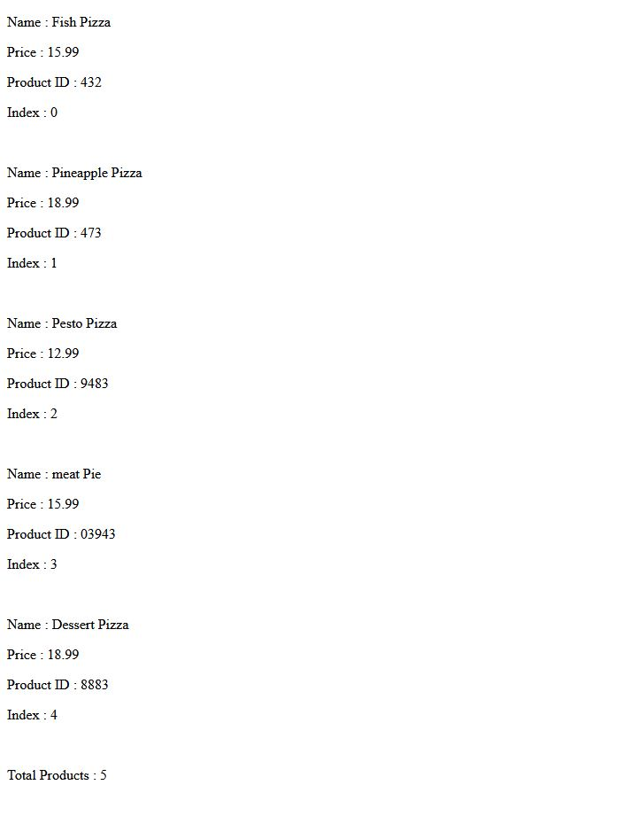

# PracticeAssessment7

This project was generated with [Angular CLI](https://github.com/angular/angular-cli) version 15.2.1.

## Development server

Run `ng serve` for a dev server. Navigate to `http://localhost:4200/`. The application will automatically reload if you change any of the source files.

## Code scaffolding
- Run `ng new app-name` to generate a new app.
- Run `ng g c component-name` to generate a new component. 
- Run `ng g i iterface-name` to generate a new interface.
- Run `ng g s service-name` to generate a new service.

## Website

https://github.com/miraj00/product_Menu-Angular

## Screenshots

 "Outputut"

## Requirements

[Assessment Instructions](https://docs.google.com/document/d/1mFSdN5tSfvbFIE3rRtFJOgVnZJNleGzJh6HyZO023Dc/preview)

[General Setup and Submission Instructions](https://docs.google.com/document/d/1cD9VveWjgX5I63PlqsAmp9mu1mJg_oRcAmyt6FGALT4/preview)
